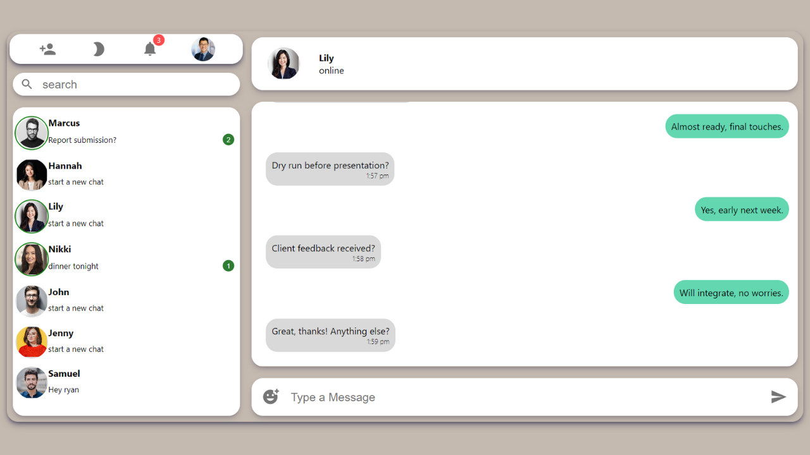
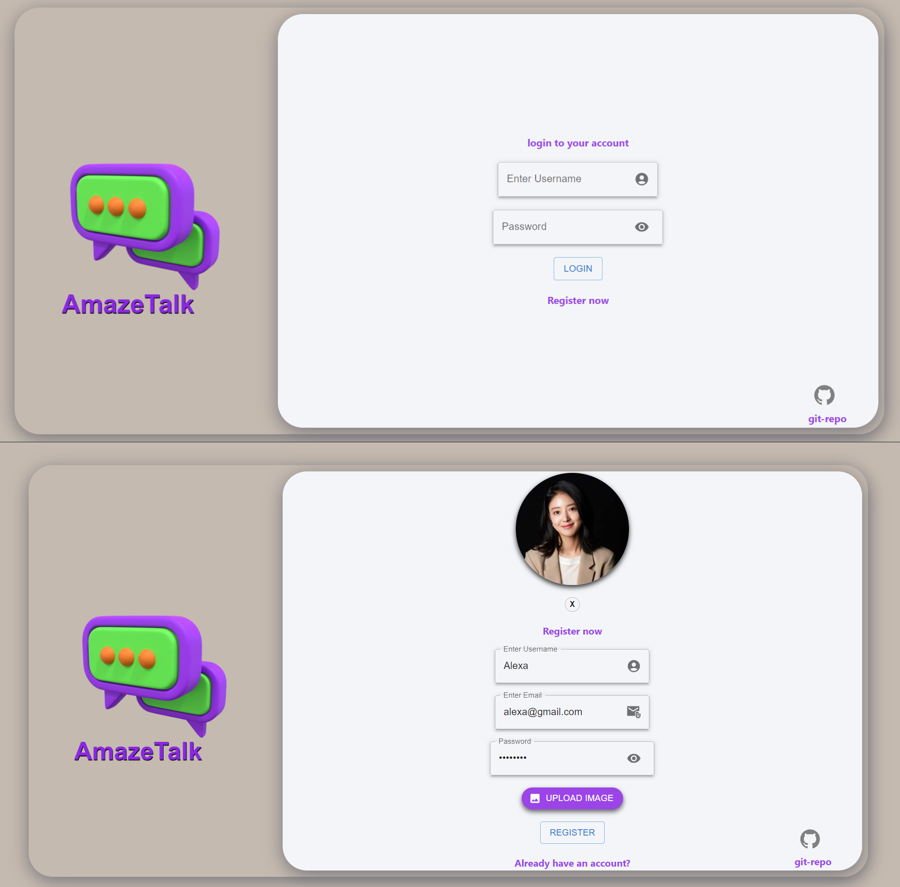
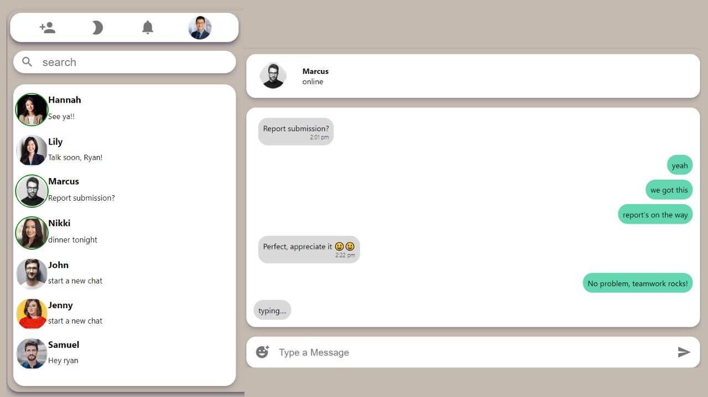
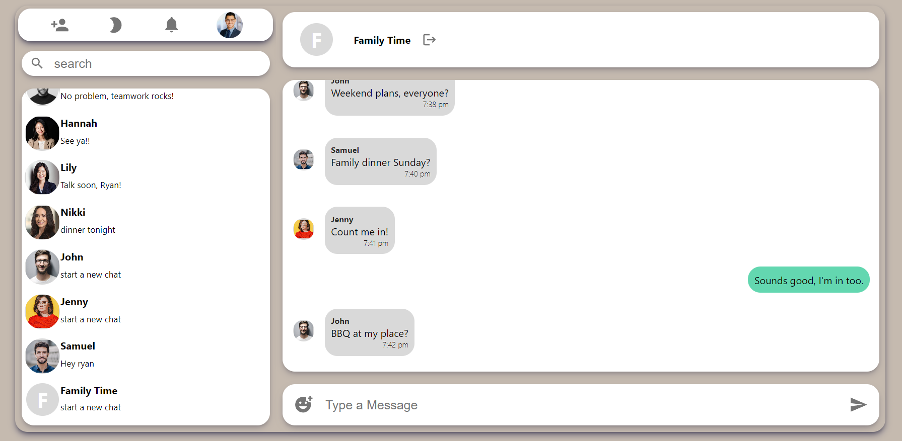
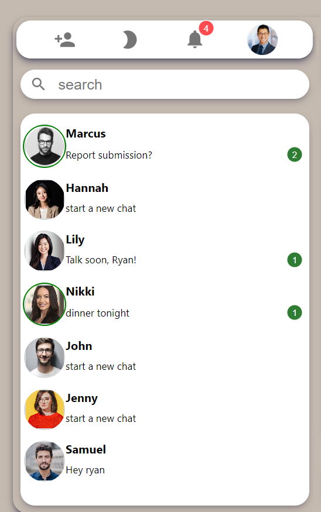
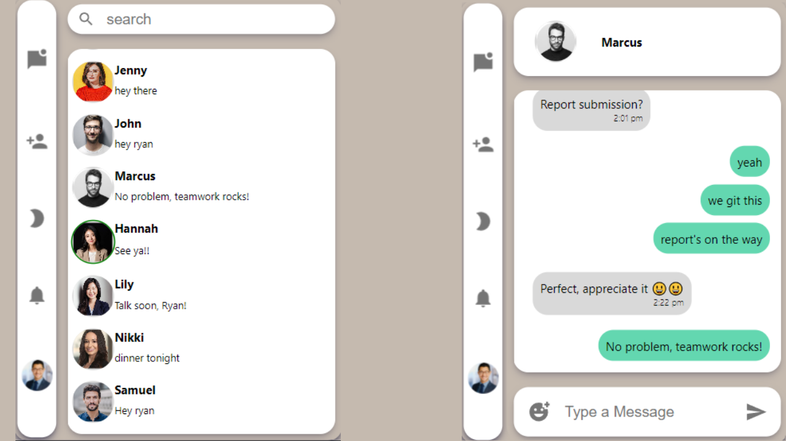

<h1 align="center">🔥AmazeTalk (MERN-Chat-App) - Live Demo:<a href="https://amaze-talk.web.app/" target="_blank"> visit 🔗</a> </h1>


# Project Overview 📚:
Welcome to Amazetalk, a real-time chatting web application built using the MERN stack (MongoDB, Express.js, React.js, Node.js) along with Socket.IO for seamless real-time communication. This project aims to provide users with an intuitive platform to engage in instant messaging while leveraging modern web technologies.

# Features 🖼️:

## Secure Login & Registration with JWT ⚠️
- AmazeTalk offers secure login and registration with JWT token authentication. Users can optionally personalize their accounts with profile pictures, enhancing their experience on the platform.


## Real-Time User Status and Typing Indicators 🤙
- AmazeTalk shows real-time user online status and typing indicators in chat, enhancing interaction and communication on the platform.


## Group Chat 👨‍👩‍👦‍👦
- AmazeTalk allows users to create groups and engage in group chats, enabling seamless collaboration and communication among multiple users in real-time.


## Real-Time Notifications 🔔
- AmazeTalk provides instant notifications in real-time, keeping users updated on new messages for timely communication and engagement.


## Dark Mode 🌚
- AmazeTalk offers a sleek and modern dark mode option, providing users with a comfortable viewing experience in low-light environments and reducing eye strain during extended usage.


## Responsive Mobile Design 📱
- AmazeTalk boasts a responsive mobile design, ensuring seamless access and usability across various devices and screen sizes. Users can enjoy the full functionality of the application on their smartphones or tablets, enhancing accessibility and convenience on the go.


## Tech-Stack 💻:
### Frontend
- React.js
- Framer motion (for animations)
### Backend
- Node.js
- Express.js
### Database
- MongoDB
### Real-Time Communication
- Socket.IO
### Authentication
- JWT (JSON Web Tokens)

# Installation Setup 🧰

To run this project locally, you need to follow these steps:

### 1. Clone the Repository

```bash
git clone https://github.com/vibhorarya12/AmazeTalk-MERN-CHAT-APP.git
````
### 2. Install Dependencies for Client
Navigate to the client folder
```bash
cd client/amazetalk
````
Install dependencies using npm:
```bash
npm install
````
### 3. Enviroment variables setup for client
Navigate
```bash
cd client/amazetalk
````
create a new .env file
```bash
 touch .env && echo REACT_APP_API_KEY=http://localhost:5000 > .env
````
### 4. Install Dependencies for Server
Navigate to the server folder
```bash
cd ../..
cd server
````
Install dependencies using npm
```bash
 npm install
````
### 5. Enviroment variables setup for server
within server directory create a new .env file
```bash
touch .env
````
open .env file and add these variables:
```bash
PORT = 5000
DATABASE = Your MongoDb atlas connection string here
JWT = Awz76234Screet@77
````
⚠️Note: for DATABASE variable a mongoDb atlas connection string is required . Please refer to https://www.mongodb.com/docs/guides/atlas/connection-string/

### 6. Run Server
start the server
```bash
npm start
````
### 7. Run Client Application
navigate to client directory
```bash
cd ../client/amazetalk
````
Start the React app:
```bash
npm start
````


